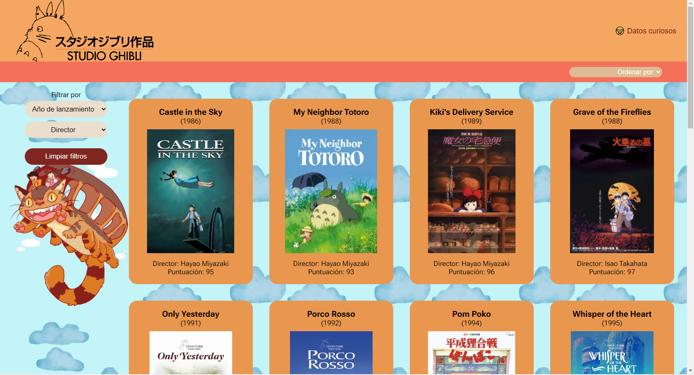
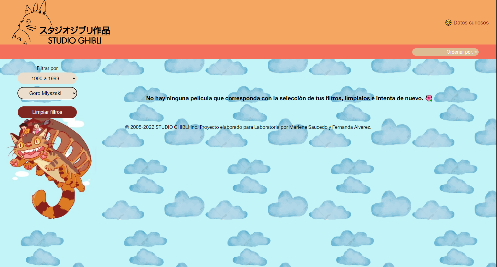
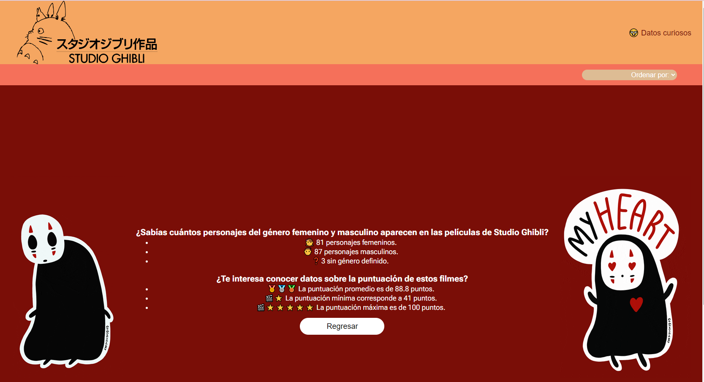
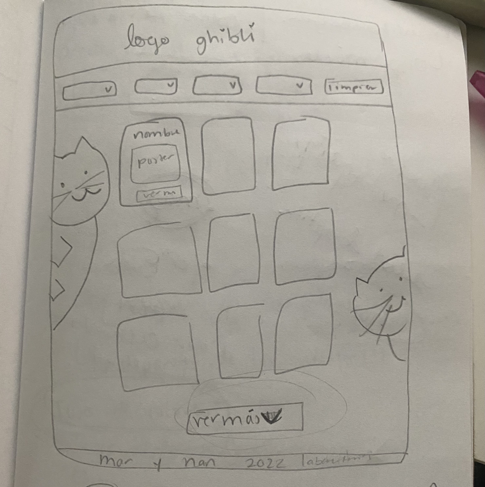
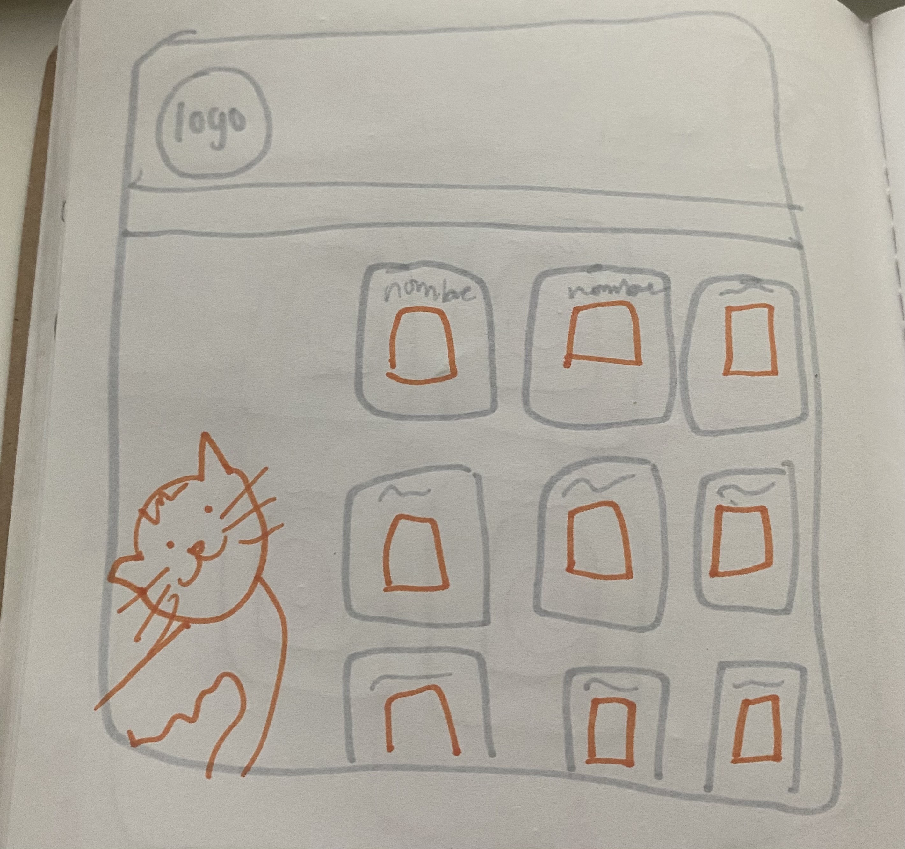
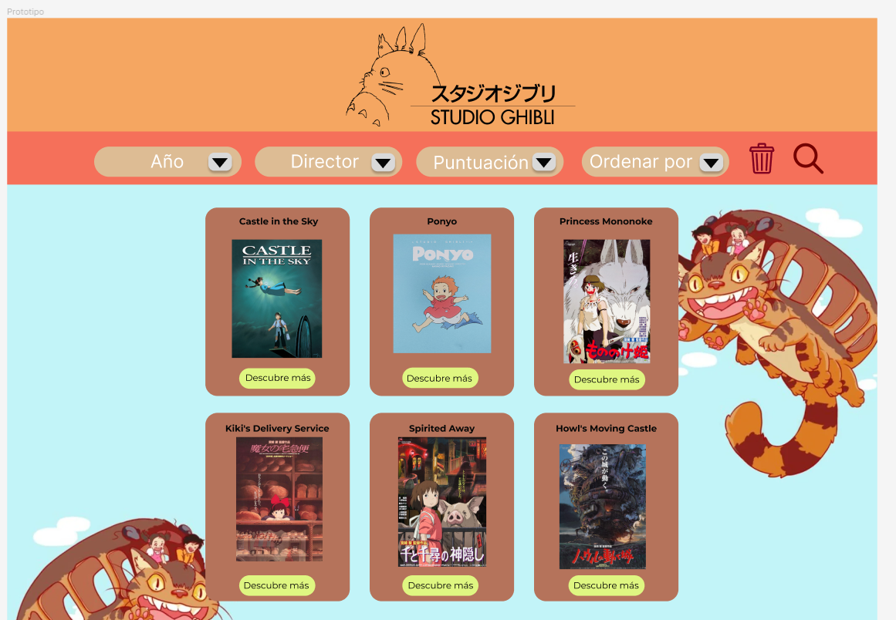
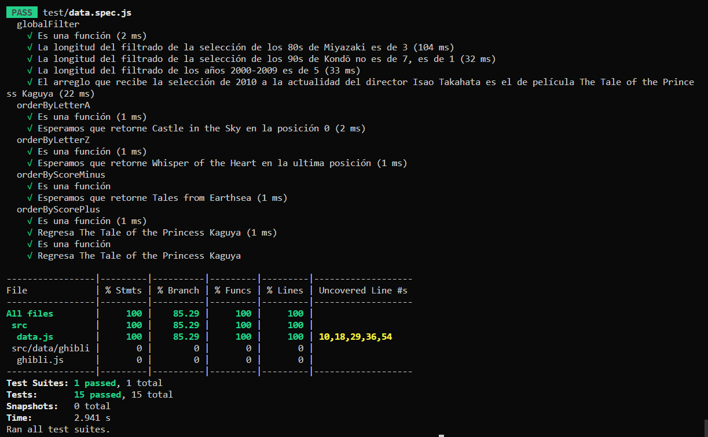

# Studio Ghibli Collection 

## Índice

* [1. Resumen del proyecto](#1-resumen-del-proyecto)
* [2. Prototipos](#2-prototipos)
* [3. Historias de usuario](#3-historias-de-usuario)
* [4. Pruebas unitarias](#4-pruebas-unitarias)

***

## 1. Resumen del proyecto

Se creó un sitio web dedicado a Studio Ghibli para que los usuarios pudieran conocer los nombres de las películas, así como su director y año de lanzamiento, al igual que la puntuación en el sitio Rotten Tomatoes.  

Al aplicar los filtros y no se encuentre una coincidencia, se despliega un mensaje para que el usuario intente con otros filtros:

Los usuario tambien pueden conocer algunos datos curiosos dando click en "Datos curiosos".

## 2. Prototipos

Los primeros prototipos consistieron en los de baja fidelidad.

2.1 Prototipo de baja fidelidad

2.2 Prototipo de alta fidelidad

Se recibió feedback y se realizaron cambios al prototipo para adaptarlo a las necesidades del usuario. Se eliminó el ícono de cesto de basura, remplazándolo por un botón de "limpiar filtros" y el ícono de la lupa ya no se agregó porque no se implementó la búsqueda en nuestras historias de usuario.

## 3. Historias de Usuario

3.1 Historia 1
Yo como usuario de Ghibli quiero poder ver todas las películas para saber cuáles y cuántas son.

3.2 Historia 2
Yo como usuario de Ghibli quiero poder ver todas las películas para saber cuáles y cuántas son, así como ordenarlas de la A-Z o Z-A.

3.3 Historia 3
Yo como usuario de Ghibli quiero poder hacer todo lo de las historias anteriores y aplicar algún filtro como año o director. Se integró también poder ordenar las tarjetas por puntuación.

3.4 Historia 4
Yo como usuario de Ghibli quiero poder hacer todo lo de las historias anteriores y conocer algunos datos curiosos obtenidos a través de cálculos matemáticos.

## 4. Pruebas unitarias

Se realizaron pruebas a las principales funciones: de ordenamiento y filtrado.

